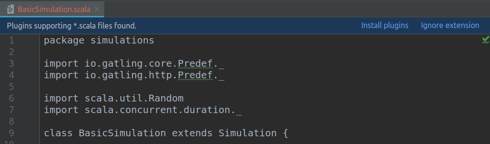
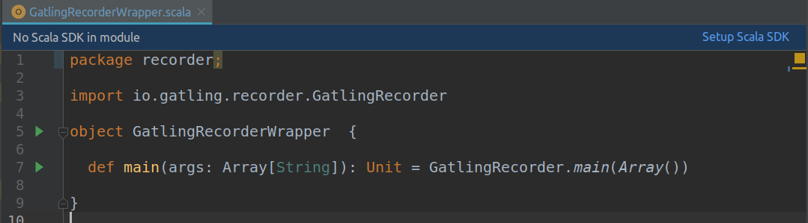
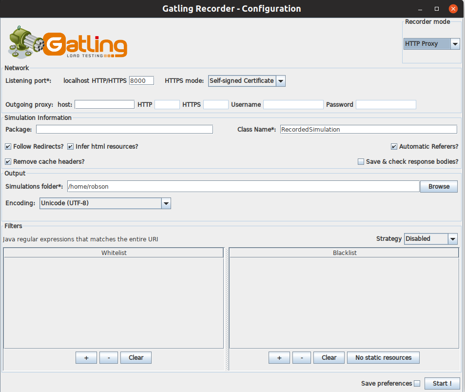
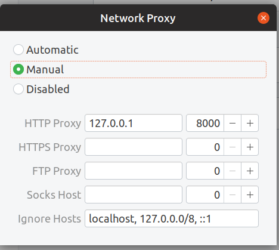

# Gatling Scaffold

> Scaffold for load test project using Gatling

## Motivation

[Gatling](https://gatling.io/) is a amazing tool for load test as code.  

The goal of this project is to provide a scaffold for building a load test suite using Gatling. Feel free to modify this project according to your needs. If you create something that might be useful to others, please submit a Pull Request.


## Running example test

This project provides two main features for load testing developer. Visualization of data and execution of simulations.

### Visualization of data

``` 
git@github.com:robsonbittencourt/gatling-scaffold.git
cd gatling-scaffold
docker-compose up 
```
The docker-compose of this project will build containers with [InfluxDB](https://www.influxdata.com/time-series-platform/influxdb/) and [Grafana](https://grafana.com/) that will allow us to visualize the simulation data during its execution.

After the build and creation of the containers access http://localhost:3000. There is already a dashboard called Gatling Report.

### Execution

```
docker run -it --rm --net="host" \
    -v "$PWD"/src/main/resources:/opt/gatling/conf \
    -v "$PWD"/src/main/scala:/opt/gatling/user-files \
    -v "$PWD"/build/reports/gatling:/opt/gatling/results \
    denvazh/gatling -s simulations.BasicSimulation
```

This command starts the sample simulation. Follow de execution in your Grafana (http://localhost:3000). After the run you can also view the Gatling report that displays more details. It is generated in ```gatling-scaffold/build/reports/gatling```


## Creating new simulations

You can rename this project and use it to create your own simulations. These should be placed in the ```src/gatling/simulations```. 

If you don't know how Gatling works I recommend these links:

- [Gatling Documentation](https://gatling.io/docs/current/general/)
- [Gatling Cheat Sheet](https://gatling.io/docs/current/cheat-sheet/)

To execute your new simulation run the Docker command previously shown passing the simulation name in the ```-s``` parameter.

## Using IDE

The following example shows how to use this project in IntelliJ. 

This project use [Gradle](https://gradle.org/) and the main config is done in build.gradle file. Import the project as a Gradle project in IntelliJ.

Open the BasicSimulation file and IntelliJ will suggest you to install the Scala plugin.



After restart IntelliJ open the same file and the IDE shows another sugestion: Configure Scala SDK.



After these settings everything should be right for you to create your simulations.

### Using Recorder

Gatling has a tool to record user's actions in a browser and automatically create a simulation. To use this tool run the class ```src/gatling/recordes/GatlingRecorderWrapper.scala ```.



Select the output path where the simulation file will be created. Before proceeding it is necessary to configure your proxy to direct to the Recorder. Here's an example using Ubuntu, but it should not be any different on other systems.



After this configuration is done start the Recorder and simulate the user's actions in the Browser. When you stop the Recorder the simulation file is generated with all your previous steps.

More details about Gatling Recorder can be found [here](https://gatling.io/docs/2.3/http/recorder/).


## Acknowledgments

This project used as a foundation open source projects and resources that other people have created. This shows when it is important to share our creations whenever possible because when we do this we have the chance to help several people.

- [David Blooman](https://github.com/dblooman) - By the [project](https://github.com/dblooman/gatling-docker) that inspired this
- [Denis Vazhenin](https://github.com/denvazh) - By the [Docker image](https://github.com/denvazh/gatling) used to perform the simulations
- [polarnik](https://github.com/polarnik) - By the [Grafana Dashboard](https://grafana.com/dashboards/9935) which I used as a base