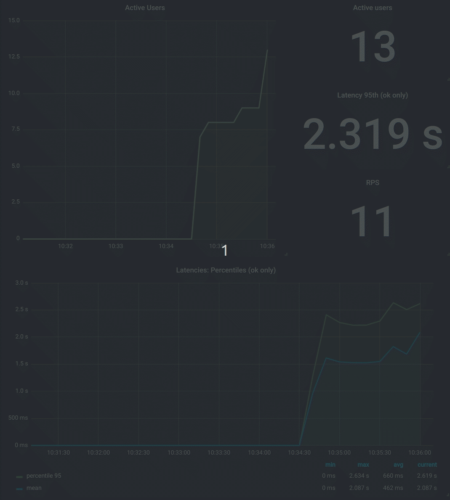

# Gatling Scaffold

> Scaffold for load test project using Gatling

## Motivation

[Gatling](https://gatling.io/) is a amazing tool for load test as code.  

The goal of this project is to provide a scaffold for building a load test suite using Gatling. Feel free to modify this project according to your needs. If you create something that might be useful to others, please submit a Pull Request.



This project uses Kotlin to write the tests. It is possible to adapt it to use Java without much effort. [Here's a project](https://github.com/gatling/gatling-gradle-plugin-demo-java) that uses Java.

## Running example test

This project provides two main features for load testing developer. Visualization of data and execution of simulations.

### Visualization of data

``` 
git clone git@github.com:robsonbittencourt/gatling-scaffold.git
cd gatling-scaffold
docker-compose up 
```
The docker-compose of this project will build containers with [InfluxDB](https://www.influxdata.com/time-series-platform/influxdb/) and [Grafana](https://grafana.com/) that will allow us to visualize the simulation data during its execution.

After the build and creation of the containers access http://localhost:3000. There is already a dashboard called Gatling Report.

### Execution

```
docker run --rm --net="host"\
  -v "$PWD":/gatling-scaffold \
  -v "$PWD"/.gradle:/home/gradle/.gradle \
  -v "$PWD"/build/reports/gatling:/build/reports/gatling \
  -w /gatling-scaffold \
  gradle:7.3.1-jdk17 gradle gatlingRun
```

This command starts the sample simulation. Follow de execution in your Grafana (http://localhost:3000). After the run you can also view the Gatling report that displays more details. It is generated in ```gatling-scaffold/build/reports/gatling```


## Creating new simulations

You can rename this project and use it to create your own simulations. These should be placed in the ```src/gatling/kotlin/simulations```. 

If you don't know how Gatling works I recommend these links:

- [Gatling Documentation](https://gatling.io/docs/current/general/)
- [Gatling Cheat Sheet](https://gatling.io/docs/current/cheat-sheet/)

To execute your new simulation run the Docker command previously shown passing the simulation full qualified class name with the Gradle Task.


```
docker run --rm --net="host"\
  -v "$PWD":/gatling-scaffold \
  -v "$PWD"/.gradle:/home/gradle/.gradle \
  -v "$PWD"/build/reports/gatling:/build/reports/gatling \
  -w /gatling-scaffold \
  gradle:7.3.1-jdk17 gradle gatlingRun-simulations.AnotherSimulation
```

When simulation is not specified, all are run.

## Acknowledgments

This project used as a foundation open source projects and resources that other people have created. This shows when it is important to share our creations whenever possible because when we do this we have the chance to help several people.

- [David Blooman](https://github.com/dblooman) - By the [project](https://github.com/dblooman/gatling-docker) that inspired this
- [Denis Vazhenin](https://github.com/denvazh) - By the [Docker image](https://github.com/denvazh/gatling) used to perform the simulations ([Before Scala is removed](https://github.com/robsonbittencourt/gatling-scaffold/commit/53d80e1194957a3273b2ee876658358fe3f284ec))
- [polarnik](https://github.com/polarnik) - By the [Grafana Dashboard](https://grafana.com/dashboards/9935) which I used as a base
